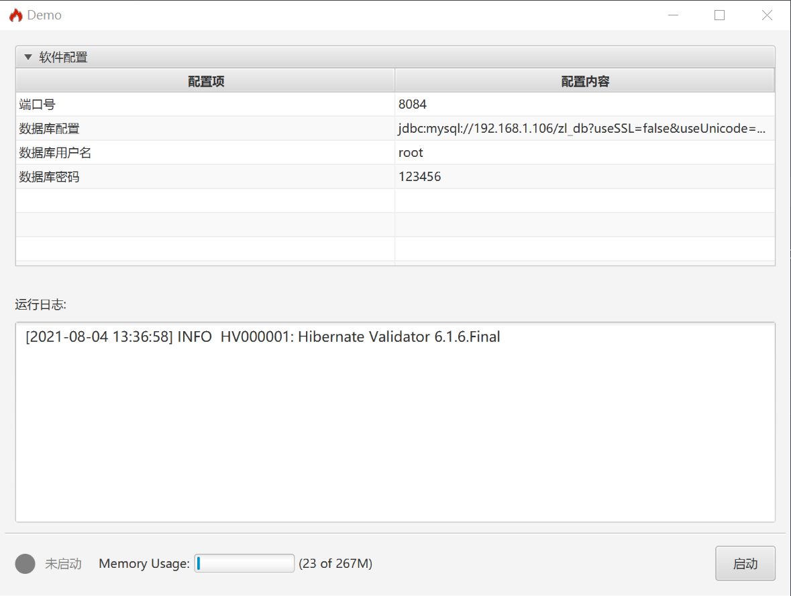
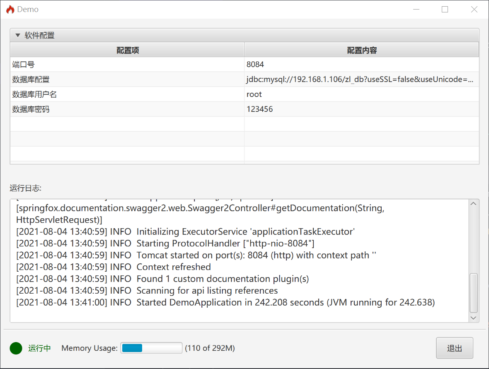
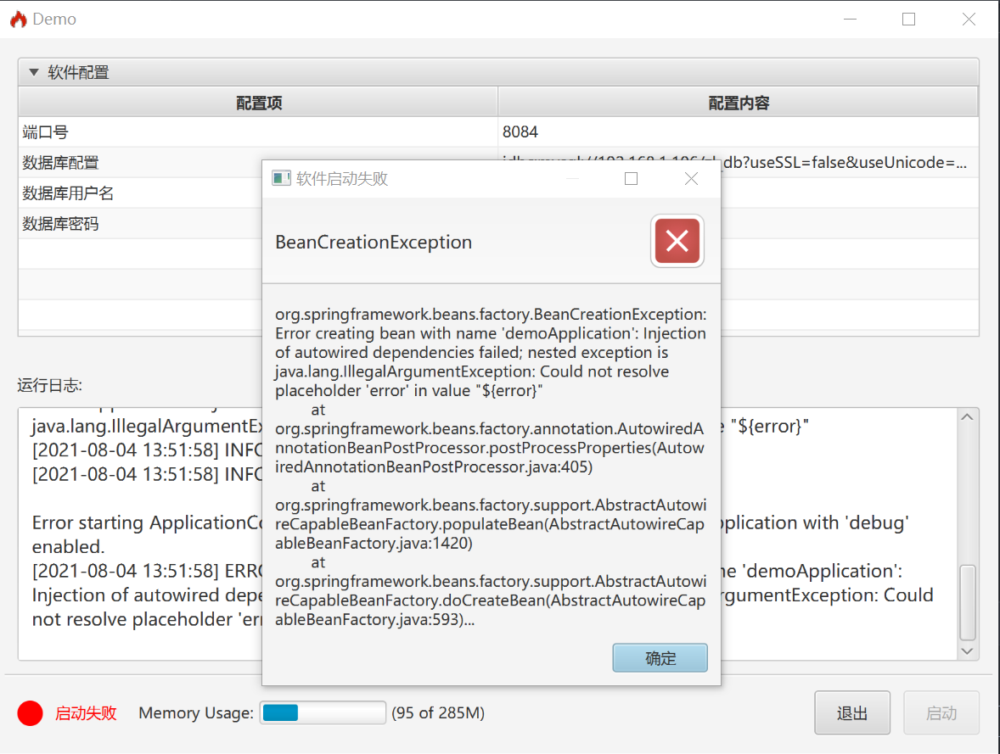

# SpringUi
SpringUi为Spring应用无侵入性地提供简单的配置启动页面。
在这个页面中可以对Spring启动时的配置项进行配置，以及启动和退出SpringBoot应用。

通过SpringUi可以很方便的为比较简单的Spring应用添加启动配置页面，如下：

SpringBoot 程序启动后：


点击启动程序后：


程序运行出错：


## 使用
在pom文件中引入此项目的maven依赖即可自动装配
> pom.xml
```xml
<dependency>
    <groupId>cn.mengfly</groupId>
    <artifactId>springui</artifactId>
    <version>1.0.0</version>
</dependency>
```

### 界面中展示日志
如果想在界面中展示日志，需要将 UiLogFilter 添加到logback配置文件中，如下：
> logback-spring.xml
```xml
<appender name="CONSOLE" class="ch.qos.logback.core.ConsoleAppender">
  <filter class="cn.mengfly.springui.UiLogFilter">
    <level>info</level>
  </filter>
</appender>
```
在 logback 配置文件中添加了如上配置后，界面中会自动加载出程序的运行日志，并且会将不同等级的日志使用不同颜色进行标识

### 框架配置
+ yaml 配置示例
> 推荐使用这种方式进行SpringUi的配置，使用properties方式配置可能会存在中文乱码的问题

```yaml
spring:
  ui:
    # 这个配置适用于Web版本的Spring应用， 当应用正常启动后，自动打开该url
    openUrlOnStared: http://www.baidu.com
    # 如果没有打开系统托盘配置，并且这个值设置为true的时候，点击程序的关闭按钮会直接退出程序
    # 如果打开了系统托盘配置，并且
    exitOnClose: true
    title: Demo
    icon: classpath:icon/icon.png
    items:
      - id: server.port
        name: 端口号
      - id: spring.datasource.url
        name: 数据库配置
      - id: spring.datasource.username
        name: 数据库用户名
      - id: spring.datasource.password
        name: 数据库密码
    tray:
      enable: true
      hiddenMsg: ${spring.ui.title} 已隐藏到系统托盘
```

+ properties 方式
```properties
# SpringUi配置
spring.ui.openUrlOnStarted=http://baidu.com
spring.ui.exitOnClose=false
spring.ui.title=安科声光报警器
spring.ui.singletonStart=true
spring.ui.items[0].id=com.portname
spring.ui.items[0].name=串口设备端口号
spring.ui.items[1].id=com.volume
spring.ui.items[1].name=声光报警器音量
spring.ui.items[2].id=spring.datasource.url
spring.ui.items[2].name=数据库uRL
spring.ui.tray.enable=true
spring.ui.tray.hiddenMsg=${spring.ui.title}已隐藏到系统托盘
```